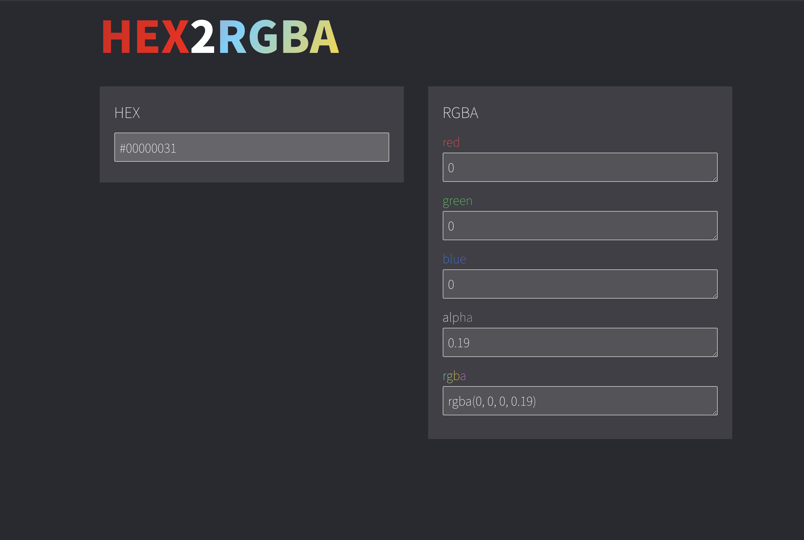

# HEX2RGBA

The hex eight-digit expression (`#00000010`) does not work in InternetExplorer.

However, there was no tool to replace this eight-digit representation with the `rgba` format that also works with IE.

So I made this simple with a svelte.

### Link

[https://neulhan.github.io/hex2rgba/](https://neulhan.github.io/hex2rgba/)

### preview

